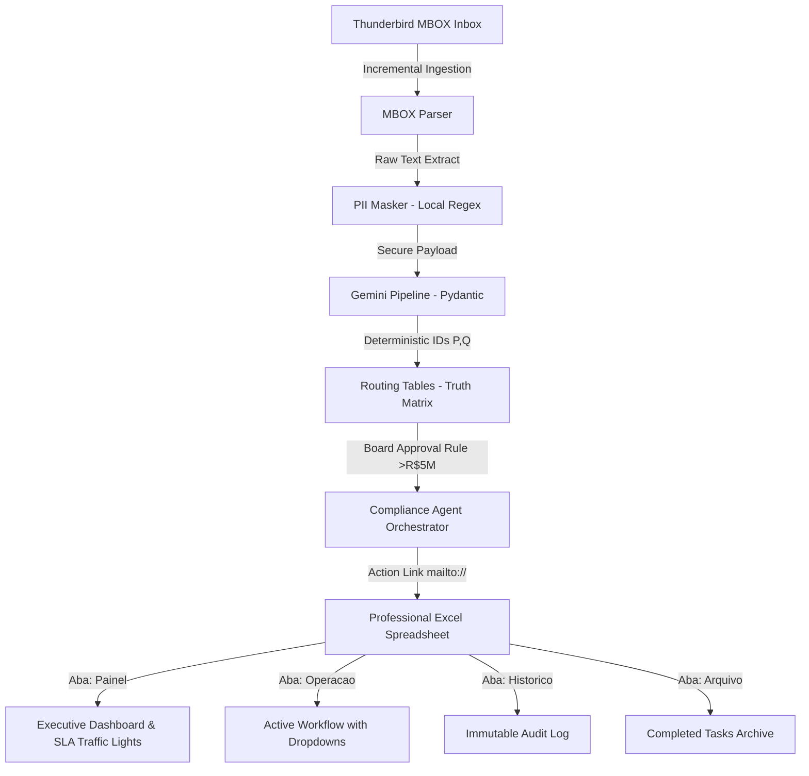

# Control-T | Compliance & AI Routing Engine v3.0

Autonomous software pipeline designed for high-value public tender orchestration, deterministic AI routing, and strict data privacy compliance (LGPD). Powered by the **Google Gemini API**, **Pydantic**, and **Python**.

---

## 🚀 Architectural Vision & Business Domain

This engine is built to manage large-scale business operations and public tenders (governed by Brazil's Law 14.133/2021) exceeding **R$ 5,000,000.00**. Precision, security, and auditing are key requirements.



---

## 💡 Key Highlights (Recruiter & AI Scanner Checklist)

- **Deterministic AI Classification**: Uses strict integer-based maps (`theme_id` 1-6 and `target_area_id` 1-8) mapped by `routing_tables.py` as a Single Source of Truth. Ensures **zero LLM hallucinations** and **reduces output tokens by ~70%**.
- **Data Privacy & Compliance (LGPD)**: Integrates a local sanitization layer (`pii_masker.py`) that masks sensitive PII (CPFs, CNPJs, bank accounts, digital signatures) *before* sending payload to the cloud.
- **Enterprise-Grade Excel Engine**: Programmatically constructs spreadsheets using `openpyxl` with dynamic dropdowns, conditional formatting, auto-calculated SLA traffic lights, strikethrough logic, and KPI metrics.
- **Automated Workflow Engine**: Implements mailto action link automation (`action_link`) allowing managers to reply to tenders with a single click.
- **Robust Architecture**: Built following SOLID principles, Clean Code guidelines, and defensive programming practices (clamping, fallbacks, and multi-layered testing).

---

## 🛠️ Technological Stack

- **Core Language**: Python 3.10+
- **Artificial Intelligence**: Google Gemini Pro (`google-generativeai`)
- **Data Validation & Parsing**: Pydantic v2
- **Data Engineering & Formatting**: Openpyxl, Regex
- **Automation & Scripting**: PowerShell, Batch, Windows Task Scheduler integration
- **Version Control & Task Tracking**: Git, GitHub Issues

---

## 📂 Project Structure

- [routing_tables.py](file:///c:/PIBIC/thunderbird-control-t/routing_tables.py): Holds truth matrices, board approval business rules, and localized date formatting.
- [gemini_pipeline.py](file:///c:/PIBIC/thunderbird-control-t/gemini_pipeline.py): Defines Pydantic validation models and manages the prompt engineering/LLM API interface.
- [mbox_parser.py](file:///c:/PIBIC/thunderbird-control-t/mbox_parser.py): Reads local Thunderbird mailboxes incrementally and extracts PDF text.
- [pii_masker.py](file:///c:/PIBIC/thunderbird-control-t/pii_masker.py): Local regular expression processor for LGPD compliance.
- [excel_handler.py](file:///c:/PIBIC/thunderbird-control-t/excel_handler.py): Builds the professional 4-tab spreadsheet with executive dashboard and dynamic validation.
- [compliance_agent.py](file:///c:/PIBIC/thunderbird-control-t/compliance_agent.py): Main orchestration script managing the event loop and pipeline states.
- [github_sync.py](file:///c:/PIBIC/thunderbird-control-t/github_sync.py): Synchronizes task lists directly to GitHub Issues.

---

## 🚀 Getting Started

### 1. Requirements
- Windows OS
- Python 3.10 or higher
- Thunderbird MBOX mailbox setup

### 2. Setup
Create a virtual environment and install dependencies:
```bash
# Create Virtual Environment
python -m venv .venv

# Activate Environment
.venv\Scripts\activate

# Install Dependencies
pip install -r requirements.txt
```

### 3. Environment Config (.env)
Create a `.env` file based on `.env.example`:
```env
GEMINI_API_KEY=your_gemini_api_key
EXCEL_PATH=C:\path\to\monitoramento_licitacoes.xlsx
SECURE_ATTACHMENTS_DIR=C:\path\to\secure_attachments
GITHUB_USERNAME=your_github_username
GITHUB_TOKEN=your_github_token
```

### 4. Running the Project

- **Offline Test Mode (Mock Ingestion & AI)**:
  Runs the entire pipeline with synthetic high-value tender data to test Excel formatting, board approval flags, and SLA calculations.
  ```bash
  python compliance_agent.py --test-mode
  ```

- **Dry-Run Mode (Real Email Ingestion with Mock AI)**:
  Ingests emails from Thunderbird but uses local parsing heuristics to save Gemini API costs.
  ```bash
  python compliance_agent.py --mock-gemini --hours 36
  ```

- **Production Mode**:
  Run the active pipeline reading from the Thunderbird Zoho Inbox and classifying using the Gemini API.
  ```bash
  python compliance_agent.py
  ```
